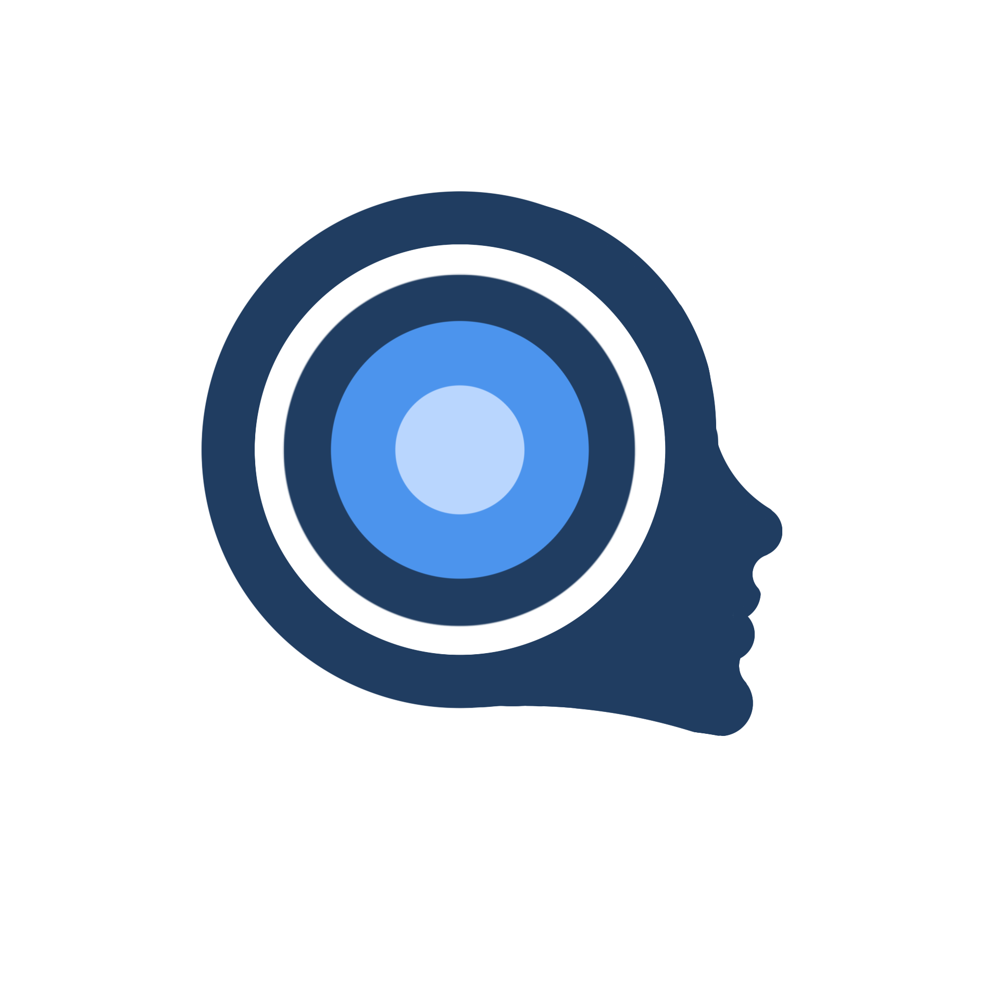

# MindCenter 

#### Projeto desenvolvido para o evento "Kick Off 2023.1" da residência Onboard - Porto Digital

---

### Ferramentas Utilizadas:
 

---

### Tema:

Saúde mental: Inovação a favor do bem-estar

### Objetivo:

Propor solução para um problema com base no tema.

O problema identificado por nós foi os problemas que os jovens têm para conseguir ter uma boa saúde mental.

### Detalhes:
Iniciado no dia 03/04/23 e finalizado no dia 26/05/23.

Com o problema em mãos, pensamos em uma maneira de solucioná-lo utilizando um aplicativo móvel com funcionalidades que ajudariam na prevenção de possíveis problemas.

---
## Aprendizado pessoal:
Foi um dos trabalhos em equipe que mais pude contribuir e receber contribuições da equipe,
percebi que uma equipe compromissada e ligada ao nosso objetivo, consegue ir longe!

---
## Aprendizados Tecnicos:
Idealizar as funcionalidades e implementa-los no prototipo navegável foi o maior desafio
que tive, pois foi também a primeira vez que utilizei figma de forma tão completa.

---
## Visualizando:

### Tela inicial:

A tela inicial já deixa acessivel todas as features do nosso projeto que seram mostrados a seguir: 
     
&nbsp;

---
#### Minha conta:

Na parte superior, o ícone para acessar a conta do usuário, que ao clicar, abrirá uma aba lateral para ver a imagem de perfil, nome e e-mail, e na parte inferior, o botão de configurações e de sair da conta.
&nbsp;
     
&nbsp;

---
#### Detalhes do gráfico:

Clicando na seta abaixo do contador de participações, é possível ver mais detalhes da sequência de participações do usuário dentro do nosso aplicativo. Esses detalhes são exibidos em um calendário com uma escala de tons de azul.
&nbsp;
     
&nbsp;

---
#### Meditação guiada:

Na barra de navegação inferior, podemos ver as funcionalidades, como o meditação guiada, para que o usuário tire um momento do seu dia para focar em si mesmo.

     
&nbsp;

 

---
#### Sons relaxantes:
Caso não seja possível tirar um momento dedicado para si mesmo durante o seu dia, existe a funcionalidade de sons relaxantes no aplicativo. Você pode configurar o app para reproduzir músicas relaxantes de sua preferência enquanto realiza suas atividades diárias. Isso pode ajudar a criar um ambiente mais tranquilo e promover uma sensação de relaxamento, mesmo durante a correria do dia a dia.
     
&nbsp;

 

---
#### Diário de Sentimentos:

Caso não seja possível tirar um momento dedicado para si mesmo durante o seu dia, existe a funcionalidade de sons relaxantes no aplicativo. Você pode configurar o app para reproduzir músicas relaxantes de sua preferência enquanto realiza suas atividades diárias. Isso pode ajudar a criar um ambiente mais tranquilo e promover uma sensação de relaxamento, mesmo durante a correria do dia a dia.

&nbsp;

 

